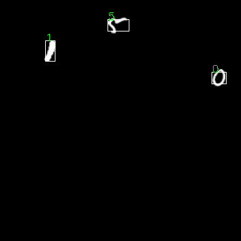

# ***FastestDet: it has higher accuracy and faster speed than Yolo-fastest https://github.com/dog-qiuqiu/FastestDet***
# :zap:Yolo-FastestV2:zap:[](https://zenodo.org/badge/latestdoi/386585431)


# Improvement
* Different loss weights for different scale output layers
* The backbone is replaced with a more lightweight shufflenetV2
* Anchor matching mechanism and loss are replaced by YoloV5, and the classification loss is replaced by softmax cross entropy from sigmoid
* Decouple the detection head, distinguish obj (foreground background classification), cls (category classification), reg (detection frame regression) 3 branches,  
# How to use
## Dependent installation
  * PIP
  ```
  pip3 install -r requirements.txt
  ```
## Test
* Picture test
  ```
  python test.py --data .\mnist_data\mnist.data --weights .\weights\mnist_detect-70-epoch-0.965800ap-model.pth --img .\mnist_data\images\val_000000.jpg
  ```
<div align=center>
 />
</div>

## How to train
### Building data sets(The dataset is constructed in the same way as darknet yolo)
* The format of the data set is the same as that of Darknet Yolo, Each image corresponds to a .txt label file. The label format is also based on Darknet Yolo's data set label format: "category cx cy wh", where category is the category subscript, cx, cy are the coordinates of the center point of the normalized label box, and w, h are the normalized label box The width and height, .txt label file content example as follows:
  ```
  11 0.344192634561 0.611 0.416430594901 0.262
  14 0.509915014164 0.51 0.974504249292 0.972
  ```
* The image and its corresponding label file have the same name and are stored in the same directory. The data file structure is as follows:
  ```
  .
  ├── train
  │   ├── 000001.jpg
  │   ├── 000001.txt
  │   ├── 000002.jpg
  │   ├── 000002.txt
  │   ├── 000003.jpg
  │   └── 000003.txt
  └── val
      ├── 000043.jpg
      ├── 000043.txt
      ├── 000057.jpg
      ├── 000057.txt
      ├── 000070.jpg
      └── 000070.txt
  ```
* Generate a dataset path .txt file, the example content is as follows：
  
  train.txt
  ```
  /home/qiuqiu/Desktop/dataset/train/000001.jpg
  /home/qiuqiu/Desktop/dataset/train/000002.jpg
  /home/qiuqiu/Desktop/dataset/train/000003.jpg
  ```
  val.txt
  ```
  /home/qiuqiu/Desktop/dataset/val/000070.jpg
  /home/qiuqiu/Desktop/dataset/val/000043.jpg
  /home/qiuqiu/Desktop/dataset/val/000057.jpg
  ```
* Generate the .names category label file, the sample content is as follows:
 
  category.names
  ```
  person
  bicycle
  car
  motorbike
  ...
  
  ```
* The directory structure of the finally constructed training data set is as follows:
  ```
  .
  ├── category.names        # .names category label file
  ├── train                 # train dataset
  │   ├── 000001.jpg
  │   ├── 000001.txt
  │   ├── 000002.jpg
  │   ├── 000002.txt
  │   ├── 000003.jpg
  │   └── 000003.txt
  ├── train.txt              # train dataset path .txt file
  ├── val                    # val dataset
  │   ├── 000043.jpg
  │   ├── 000043.txt
  │   ├── 000057.jpg
  │   ├── 000057.txt
  │   ├── 000070.jpg
  │   └── 000070.txt
  └── val.txt                # val dataset path .txt file

  ```
### Get anchor bias
* Generate anchor based on current dataset
  ```
  python3 genanchors.py --traintxt ./mnist_data/train.txt
  ```
* The anchors6.txt file will be generated in the current directory,the sample content of the anchors6.txt is as follows:
  ```
  10.63,17.67, 11.63,23.94, 15.35,17.96, 17.37,25.09, 20.76,20.40, 24.26,26.49
  0.8                                                                            # iou
  ```
### Build the training .data configuration file
* Reference./mnist_data/mnist.data
  ```
  [name]
  model_name=mnist_detect

  [train-configure]
  epochs=500
  steps=120,240
  batch_size=64
  subdivisions=2
  learning_rate=0.0003


  [model-configure]
  classes=10
  width=352
  height=352
  anchor_num=3
  anchors=10.63,17.67, 11.63,23.94, 15.35,17.96, 17.37,25.09, 20.76,20.40, 24.26,26.49

  [data-configure]
  train=./mnist_data/train.txt
  val=./mnist_data/val.txt
  names=./mnist_data/mnist.names
  ```
### Train
* Perform training tasks
  ```
  python3 train.py --data mnist_data/mnist.data
  ```
### Evaluation
* Calculate map evaluation
  ```
  python3 evaluation.py --data mnist_data/mnist.data --weights .\weights\mnist_detect-70-epoch-0.965800ap-model.pth
  ```
# Deploy
## NCNN
* Convert onnx
  ```
  python3 pytorch2onnx.py --data data/coco.data --weights .\weights\mnist_detect-70-epoch-0.965800ap-model.pth --output yolo-fastestv2.onnx
  ```
* onnx-sim
  ```
  python3 -m onnxsim yolo-fastestv2.onnx yolo-fastestv2-opt.onnx
  ```
* Build NCNN
  ```
  git clone https://github.com/Tencent/ncnn.git
  cd ncnn
  mkdir build
  cd build
  cmake ..
  make
  make install
  cp -rf ./ncnn/build/install/* ~/Yolo-FastestV2/sample/ncnn
  ```
* Covert ncnn param and bin
  ```
  cd ncnn/build/tools/onnx
  ./onnx2ncnn yolo-fastestv2-opt.onnx yolo-fastestv2.param yolo-fastestv2.bin
  cp yolo-fastestv2* ../
  cd ../
  ./ncnnoptimize yolo-fastestv2.param yolo-fastestv2.bin yolo-fastestv2-opt.param yolo-fastestv2-opt.bin 1
  cp yolo-fastestv2-opt* ~/Yolo-FastestV2/sample/ncnn/model
  ```
* run sample
  ```
  cd ~/Yolo-FastestV2/sample/ncnn
  sh build.sh
  ./demo
  ```
# Reference
* https://github.com/Tencent/ncnn
* https://github.com/AlexeyAB/darknet
* https://github.com/ultralytics/yolov5
* https://github.com/eriklindernoren/PyTorch-YOLOv3
